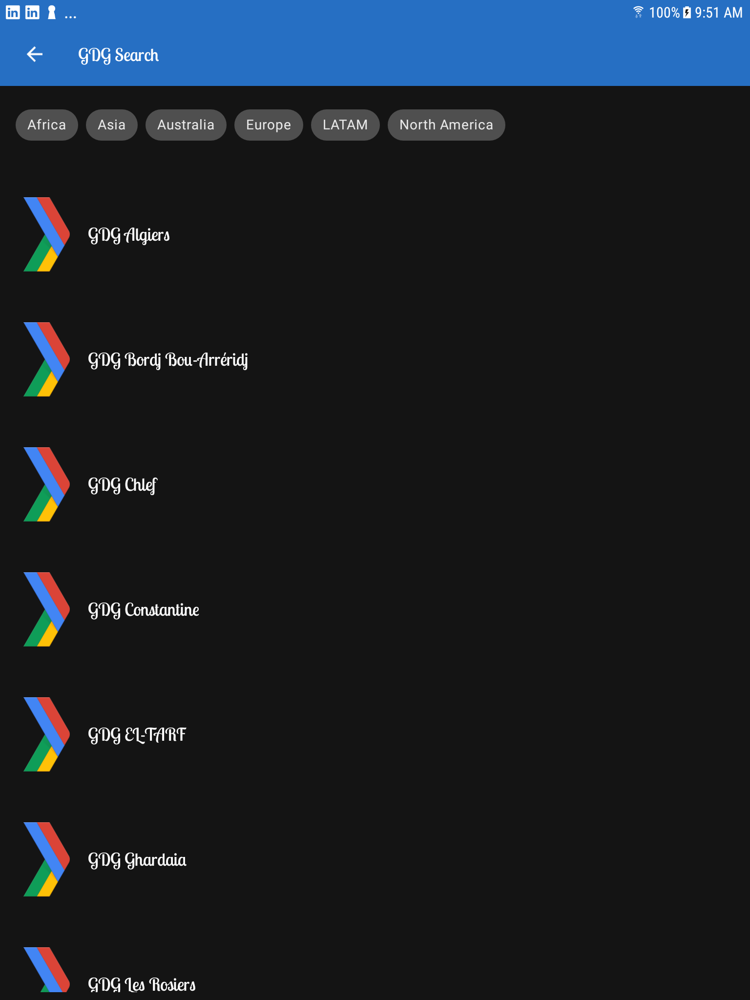
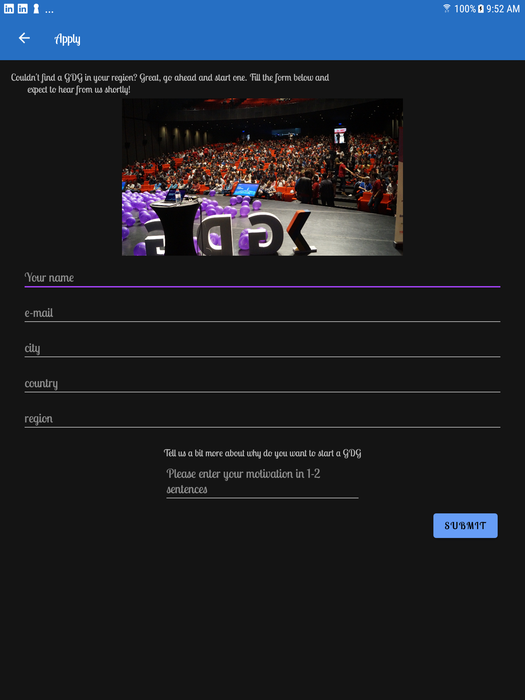

# udacity-gdg-finder

This is the ninth app for lesson 10 of the [Android App Development in Kotlin course on Udacity](https://www.udacity.com/course/developing-android-apps-with-kotlin--ud9012).

This app is not my own, but the team that developed the course.

## GDG Finder

GDGs, or Google Developer Groups, are communities of developers that focus on Google technologies - including Android - around the world. They host lots of different events like meetups, conferences, study jams, and more!

GDG Finder helps you locate GDGs around the world or start one of your own. You'll learn the principles of Material Design so you can implement professional looking designs and build Android apps that users love to use!

 
## Screenshots

